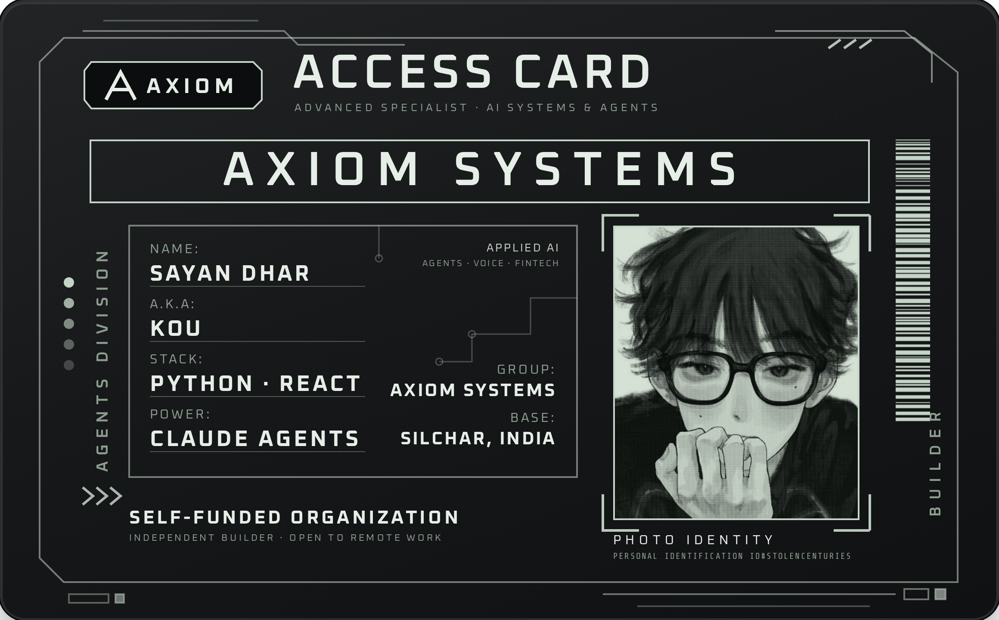
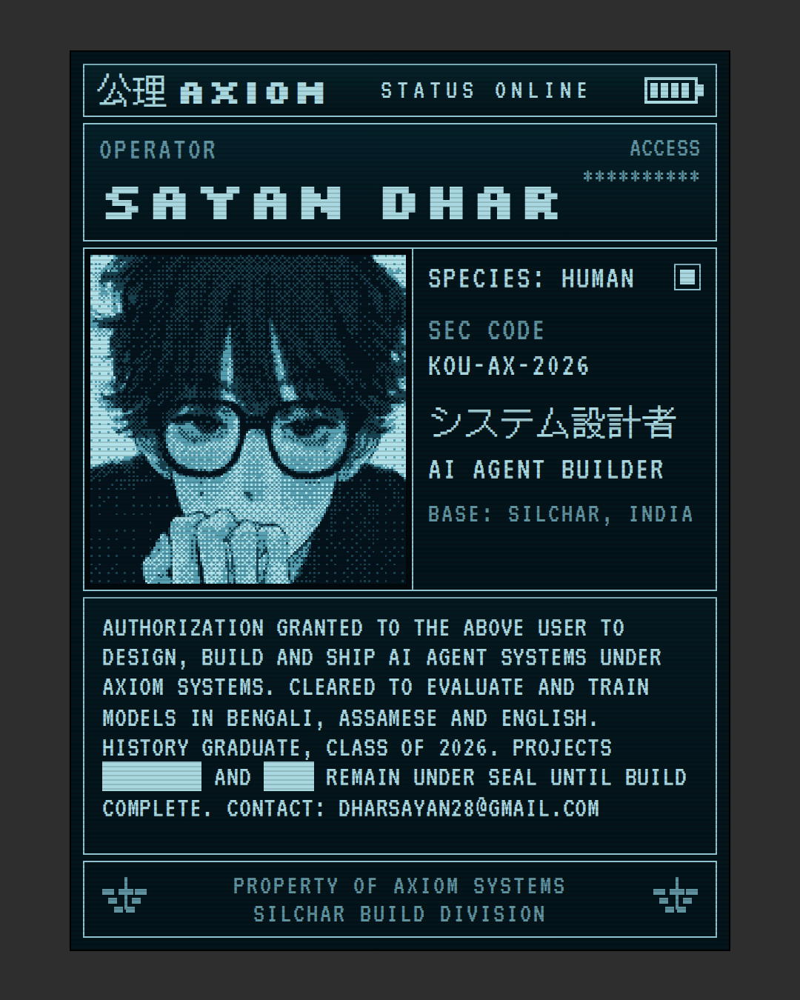

<p align="center">
  
</p>

<p align="center">
  
</p>

``` ts
/// <summary>
/// Open to remote AI evaluation, AI training, and
/// junior AI engineering work. History graduate
/// building AI agent systems at Axiom Systems.
/// </summary>

export class INFORMATION {
  public name     = "Sayan Dhar";
  public alias    = "Kou";
  public title    = "AI Systems Builder";
  public studio   = "Axiom Systems";
  public email    = "dharsayan28@gmail.com";
  public position = ["Silchar", "Assam", "India"];
  public remote   = true;
}

export enum PLATFORMS {
  Windows,
  Web
}

export enum LANGUAGES {
  Python,
  JavaScript,
  React
}

export enum AI_STACK {
  ClaudeAgentSDK,
  Whisper,
  KokoroTTS,
  Pycaw
}

export enum TOOLS {
  Git,
  GitHub,
  GitHubPages
}

export enum SPOKEN {
  Bengali,
  Assamese,
  English
}

export enum MEDIA {
  // GitHub
  "github.com/stolencenturies",
  // LinkedIn
  "in/sayan-dhar-5ab66428a"
}

export enum PROFILE {
  SelfDirected,
  Analytical,
  Curious,
  Disciplined
}

export class FORMATIONS {
  public Bachelor(): void {
    const level   = "Bachelor of Arts";
    const field   = History;
    const college = "Gurucharan College, Silchar";
    const year    = 2026;
  }

  public Master(): void {
    const level  = "Master's";
    const field  = History;
    const status = "Planned";
  }
}

export class EXPERIENCES {
  public AxiomSystems(): void {
    const role = "Founder & Builder";
    const type = Studio;
    // Independent studio building AI agent systems.
  }

  public Atlas(): void {
    const role = "Video Labeling & Auditing";
    const type = Contract;
    const mode = Remote;
  }

  public Legiit(): void {
    const type = Freelance;
  }
}

export class PROJECTS {
  public Sentinel(): void {
    const type = Agent;
    // AI compliance agent for US community banks.
  }

  public Beru(): void {
    const type = Agent;
    // Agent layer for a gaming marketplace.
  }

  public VoiceLine(): void {
    const stack = [Python, Whisper, KokoroTTS, ClaudeAgentSDK];
    // Windows voice assistant. Hold-to-talk, local
    // speech-to-text and text-to-speech, Spotify
    // volume ducking through pycaw.
  }

  public TradingBot(): void {
    const stack  = [Python];
    const status = "InProgress";
    // EUR/USD moving-average strategy.
  }

  public BengalThesis(): void {
    const type   = Research;
    const status = "InProgress";
    // Bengal colonial history.
  }
}
```
